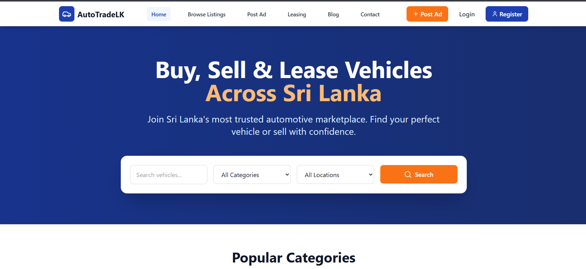

# AutoTradeLK

 AutoTradeLK is an online platform for vehicle buying, selling, and leasing in Sri Lanka. It serves multiple user roles including buyers, sellers, leasing companies, and administrators.

## Features

* Browse vehicles by category, make, model, year, and location
* Post ads for vehicles you want to sell or lease
* Register to access advanced features such as saved searches and notifications
* Advanced search capabilities, including filtering by price, mileage, and features
* Vehicle details pages with photos, descriptions, and contact information
* Leasing options for vehicles
* Blog with articles about the automotive industry
* Contact page with map and contact information

## Technologies Used

* React
* React Router
* Tailwind CSS
* TypeScript
* Vite

## Installation

1. Clone the repository
2. Install dependencies with `npm install`
3. Start the development server with `npm run dev`

## License

This project is licensed under the MIT License. See the [LICENSE](LICENSE) file for details.
